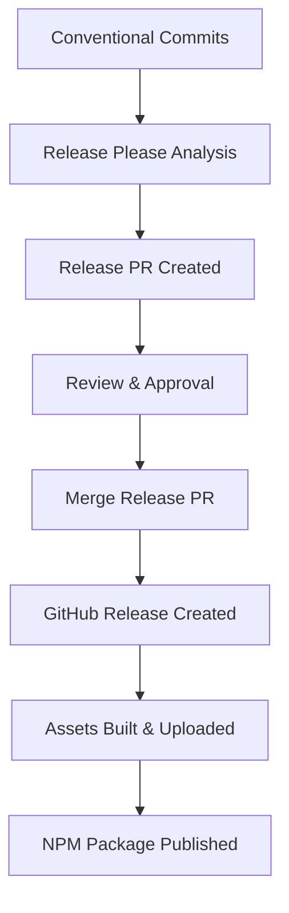

# Release Documentation

This document outlines the release strategy, processes, and best practices for the ECS Game Engine.

## Table of Contents

- [Release Strategy](#release-strategy)
- [Automated Release System](#automated-release-system)
- [Release Types](#release-types)
- [Release Workflow](#release-workflow)
- [Version Management](#version-management)
- [Security and Quality](#security-and-quality)
- [Release Assets](#release-assets)
- [NPM Publishing](#npm-publishing)
- [Communication](#communication)
- [Troubleshooting](#troubleshooting)

## Release Strategy

The ECS Game Engine follows a structured release strategy designed for:

- **Predictability**: Regular, automated releases based on conventional commits
- **Quality**: Comprehensive testing, security scanning, and quality gates
- **Transparency**: Clear changelogs and release notes
- **Stability**: Semantic versioning with clear upgrade paths

### Release Schedule

- **Stable Releases**: Triggered by accumulated features and fixes
- **Patch Releases**: For critical bug fixes and security updates
- **Pre-releases**: For testing major changes and gathering feedback
- **Emergency Releases**: For critical security vulnerabilities

## Automated Release System

We use [Release Please](https://github.com/googleapis/release-please) for automated version management and releases.

### How It Works

1. **Conventional Commits** are analyzed to determine version bump type
2. **Release PR** is automatically created with changelog and version updates
3. **GitHub Release** is created when the release PR is merged
4. **Assets** and artifacts are built and attached to the release

### Conventional Commit Types

| Type | Version Bump | Description |
|------|--------------|-------------|
| `feat` | Minor | New features |
| `fix` | Patch | Bug fixes |
| `feat!` | Major | Breaking changes |
| `perf` | Patch | Performance improvements |
| `docs` | None | Documentation only |
| `test` | None | Test changes |
| `chore` | None | Maintenance |

## Release Types

### Stable Releases (v1.2.3)

**Trigger**: Merge of release PR from Release Please
**Process**: Full CI/CD pipeline with all quality gates
**Assets**: Complete distribution packages and documentation

### Pre-releases (v1.2.3-alpha.1)

**Trigger**: Manual tag creation with pre-release suffix
**Process**: Full CI/CD pipeline with pre-release flag
**Use Cases**:
- Testing breaking changes
- Feature previews
- Release candidate testing

### Patch Releases (v1.2.4)

**Trigger**: Critical fixes via hotfix branches
**Process**: Expedited release for urgent fixes
**Use Cases**:
- Security vulnerabilities
- Critical bug fixes
- Performance regressions

## Release Workflow

### Standard Release Process



### Step-by-Step Workflow

1. **Development Phase**
   - Developers commit using conventional commit format
   - CI/CD runs tests on all commits
   - Release Please tracks changes for next release

2. **Release Preparation**
   - Release Please creates/updates release PR
   - Changelog is automatically generated
   - Version numbers are updated across files

3. **Release Review**
   - Release PR is reviewed by maintainers
   - Manual testing of significant changes
   - Security and performance review

4. **Release Execution**
   - Release PR is merged to main branch
   - GitHub release is automatically created
   - Build artifacts are generated and uploaded

5. **Post-Release**
   - NPM package is published (when ready)
   - Release announcement
   - Documentation updates

## Version Management

### Semantic Versioning

We follow [Semantic Versioning](https://semver.org/) (SemVer):

**MAJOR.MINOR.PATCH[-PRERELEASE]**

- **MAJOR**: Breaking changes that require user action
- **MINOR**: New features that are backward compatible
- **PATCH**: Bug fixes and minor improvements
- **PRERELEASE**: Alpha, beta, or release candidate versions

### Version Bump Rules

| Change Type | Example Commit | Version Bump |
|-------------|----------------|--------------|
| Breaking Change | `feat!: change API signature` | Major |
| New Feature | `feat(core): add new component type` | Minor |
| Bug Fix | `fix(systems): resolve race condition` | Patch |
| Documentation | `docs: update API documentation` | None |

### Version Synchronization

The following files are automatically updated with version changes:
- `package.json`
- `CHANGELOG.md`
- `README.md` (version badges)
- Example files with version references

## Security and Quality

### Security Scanning

Every release includes:
- **Dependency Audit**: Check for known vulnerabilities
- **SARIF Upload**: Security findings uploaded to GitHub Security
- **Trivy Scanning**: File system vulnerability scanning
- **Code Analysis**: Static analysis for security issues

### Quality Gates

All releases must pass:
- ✅ **All Tests**: 100% test suite pass rate
- ✅ **Type Checking**: No TypeScript compilation errors
- ✅ **Linting**: Code style and quality checks
- ✅ **Build**: Successful production build
- ✅ **Security**: No high-severity vulnerabilities
- ✅ **Performance**: Benchmark regression checks

### Performance Monitoring

Release process includes:
- Performance benchmark execution
- Memory usage analysis
- Bundle size tracking
- Performance regression detection

## Release Assets

### Asset Types

Each release includes:

1. **Source Code Archives**
   - `source-code.tar.gz`: Complete source code
   - `dist-vX.Y.Z.tar.gz`: Built distribution

2. **Checksums**
   - `checksums.txt`: SHA256 checksums for all assets

3. **Documentation**
   - Updated README.md
   - CHANGELOG.md with release notes
   - API documentation

4. **Examples**
   - Working example applications
   - Updated for current version

### Asset Generation

Assets are automatically generated during the release process:

```bash
# Source archive (excludes git, node_modules, .github)
tar --exclude='.git' --exclude='node_modules' --exclude='.github' \
    -czf source-code.tar.gz .

# Distribution archive
tar -czf dist-vX.Y.Z.tar.gz \
    dist/ package.json README.md CHANGELOG.md LICENSE examples/

# Generate checksums
sha256sum *.tar.gz > checksums.txt
```

## NPM Publishing

### Current Status

NPM publishing is **prepared but disabled** while the project is in development.

### When Ready for NPM

To enable NPM publishing:

1. **Set Package Public**
   ```json
   {
     "private": false,
     "name": "@danjdewhurst/ecs-ts"
   }
   ```

2. **Add NPM Token**
   - Add `NPM_TOKEN` secret to GitHub repository
   - Configure proper NPM access permissions

3. **Enable Publishing**
   - Uncomment NPM publishing steps in `.github/workflows/release.yml`
   - Test with a pre-release version first

### Publishing Strategy

- **Stable Releases**: Published to `latest` tag
- **Pre-releases**: Published to `next` tag
- **Legacy Support**: Maintain LTS versions with `lts` tag

## Communication

### Release Announcements

For major releases:

1. **GitHub Release**: Automatic with detailed changelog
2. **Social Media**: Announce significant features
3. **Documentation**: Update getting started guides
4. **Community**: Post in discussions and relevant forums

### Release Notes

Automatically generated release notes include:

- ✨ **Features**: New functionality
- 🐛 **Bug Fixes**: Resolved issues
- ⚡ **Performance**: Performance improvements
- 💥 **Breaking Changes**: API changes requiring migration
- 📚 **Documentation**: Documentation updates

### Migration Guides

For breaking changes, include:
- **What Changed**: Clear description of changes
- **Migration Steps**: Step-by-step upgrade instructions
- **Code Examples**: Before/after code samples
- **Timeline**: Deprecation and removal schedule

## Troubleshooting

### Common Issues

**Release PR Not Created**
- Check conventional commit format
- Verify Release Please configuration
- Review repository permissions

**Build Failures**
- Check CI logs for specific errors
- Verify all tests pass locally
- Review dependency changes

**Missing Assets**
- Check build script execution
- Verify file paths in workflow
- Review upload permissions

**Version Conflicts**
- Ensure clean working directory
- Check for manual version edits
- Verify Release Please manifest

### Emergency Procedures

**Critical Security Issue**
1. Create hotfix branch from latest release
2. Apply minimal fix with `fix!` commit
3. Create emergency release manually
4. Coordinate disclosure timeline

**Release Rollback**
1. Do not delete GitHub releases (breaks links)
2. Create new patch release with fix
3. Update documentation with known issues
4. Communicate rollback to users

**Build System Failure**
1. Check GitHub Actions status
2. Review workflow permissions
3. Test build process locally
4. Contact GitHub support if needed

## Monitoring and Metrics

### Release Metrics

Track:
- Release frequency and timing
- Time from commit to release
- Build success/failure rates
- Security scan results
- Performance benchmark trends

### User Adoption

Monitor:
- Download statistics
- GitHub stars/forks
- Issue and discussion activity
- NPM package usage (when published)

---

For questions about the release process, please:
- Check existing [GitHub Issues](https://github.com/danjdewhurst/ecs-ts/issues)
- Start a [Discussion](https://github.com/danjdewhurst/ecs-ts/discussions)
- Contact [@danjdewhurst](https://github.com/danjdewhurst)